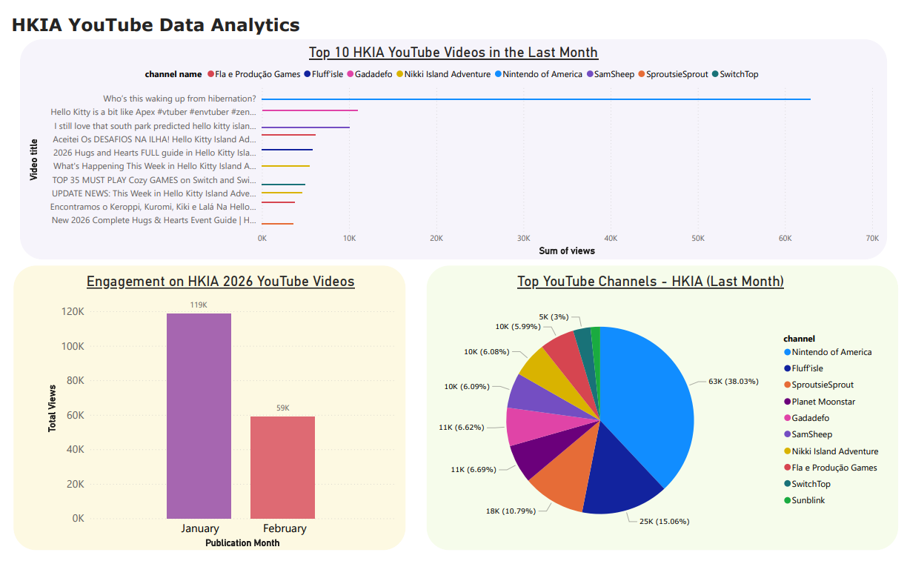

## HKIA YouTube Data Analysis

Collecting YouTube analytics for the search term **"Hello Kitty Island Adventure"** from the past month. This was done using **Python**, along with the **pandas** library for data manipulation and the **YouTube Data API** to fetch the video statistics.

The resulting dataset includes metrics such as views, date published, video title, and channel name, which was used for further analysis.

Here's an example of the dashboard I created via Power BI using the data collected:

The dashboard reveals insights that the video titled **"Who's this waking up from hibernation"** by the channel **Nintendo of America** was the most viewed in the past month indicating a future or recent game update in Hello Kitty Island Adventure on the Nintendo Switch platform.
